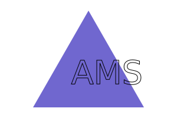
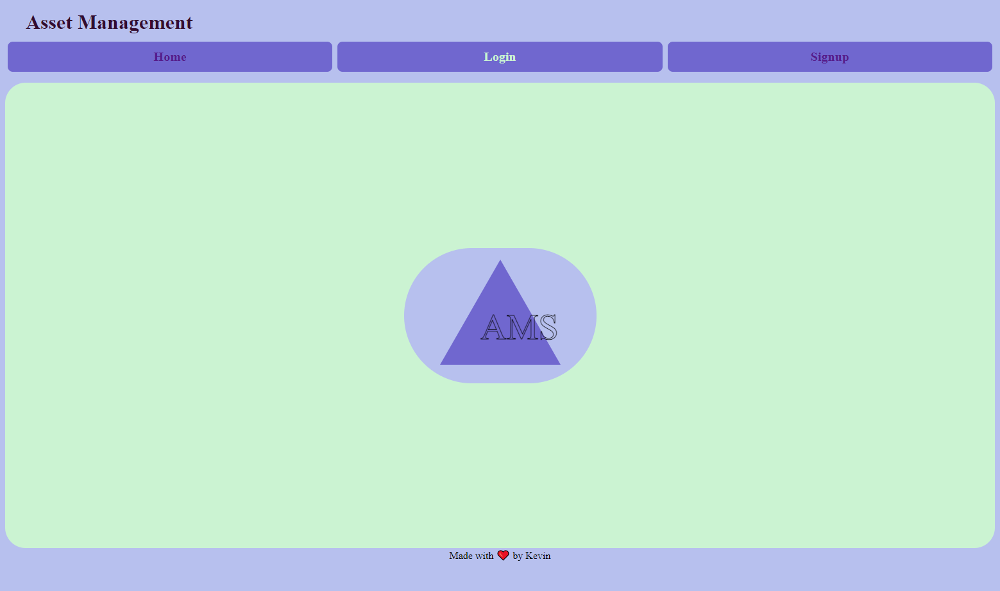
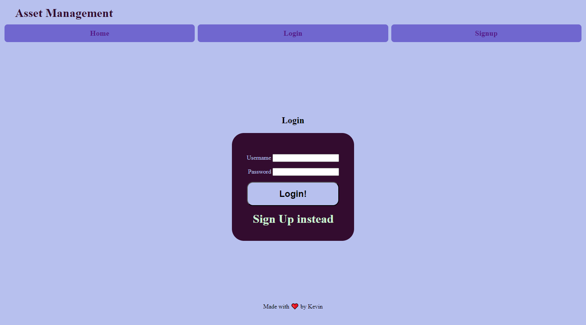
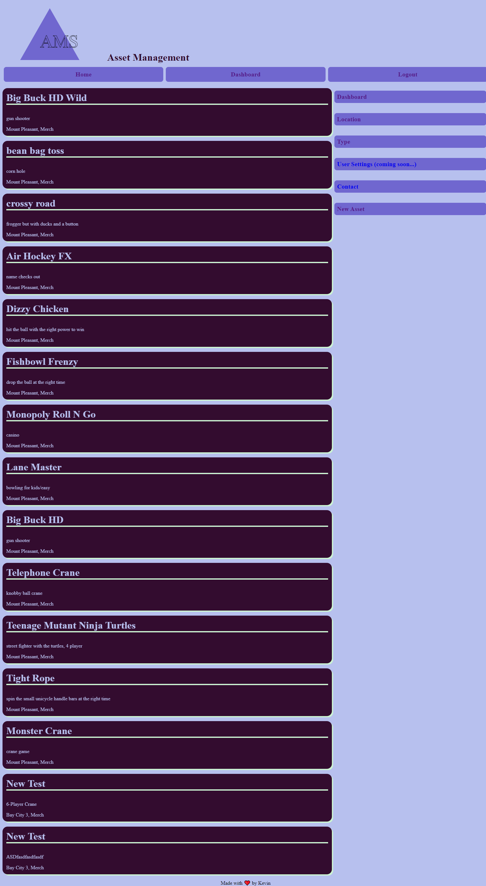
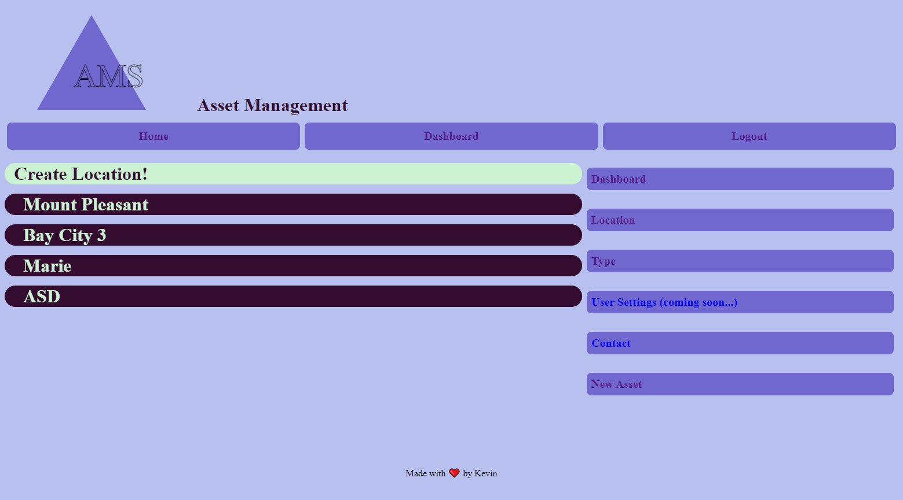

# asset-management-system 

## Description

Asset Management System is a CMS prof of concept, you can create an account, view assets, locations, and types. Create, Update and Delete Assets, Locations, and types. 

## Stack

  
  

  
  
  


## Table of Contents 

- [User Story](#user-story)
- [Installation](#installation)
- [Screenshot](#screenshot)
- [Deployed](#credits)
- [License](#license)

## User Story
```md
AS A user who manages assets  
I WANT a CMS-style asset site  
SO THAT I can record asset information, location, type, and user information to allow the user a CMS for their asset, what ever it may be 
```

## Installation
Clone the Repo,
Naviagte to the root Dir.  
npm i  
mysql -u <username> -p 
proceed to enter password
SOURCE db/schema.sql
type quit
node seeds/index.js
npm start


## Credits

[Kevin Rhode](https://github.com/KevinRhode)

[heroku](https://coding-boot-camp.github.io/full-stack/heroku/deploy-with-heroku-and-mysql)
[AC](https://animate.style/)
[Badges](https://ileriayo.github.io/markdown-badges/)

## Screenshot





## License

[MIT](https://choosealicense.com/licenses/mit/)